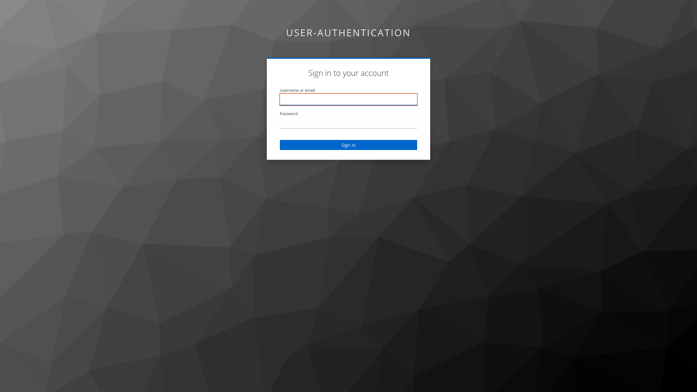

<p align="center"></p>&nbsp;

[](https://github.com/DataCloud-project/ALL-PIPE/issues)
[](https://opensource.org/licenses/Apache-2.0)


# ALL-PIPE

ALL-PIPE is a web application under https://datacloud-toolbox.euprojects.net which provides centralized access to all the components of Datacloud project, namely: [DIS-PIPE](https://github.com/DataCloud-project/DIS-PIPE), [DEF-PIPE](https://github.com/DataCloud-project/DEF-PIPE-DSL), [SIM-PIPE](https://github.com/DataCloud-project/SIM-PIPE), [R-MARKET](https://github.com/DataCloud-project/R_MARKET_UI), [ADA-PIPE](https://github.com/DataCloud-project/ADA-PIPE), [DEP-PIPE](https://github.com/DataCloud-project/DEP-PIPE).

A brief guide to all-pipe:

> Home Page

  <br/><br/>

> Tools Description & Access

  <br/><br/>

> User Registration Page

  <br/><br/>

> Login Page

  <br/><br/>

> Redirect to Integrated DEP-PIPE tool after successful login 

  <br/><br/>


# Useful Information for Development

### About environmental variables

To run the project, first create a .env file with the variables listed in .env.example and by assigning the appropriate values.

To begin local development, run : 
```
npm install
npm run dev
``` 


### Vue 3 + Typescript + Vite

This template should help get you started developing with Vue 3 and Typescript in Vite. The template uses Vue 3 `<script setup>` SFCs, check out the [script setup docs](https://v3.vuejs.org/api/sfc-script-setup.html#sfc-script-setup) to learn more.

### Recommended IDE Setup

- [VSCode](https://code.visualstudio.com/) + [Volar](https://marketplace.visualstudio.com/items?itemName=johnsoncodehk.volar)

### Type Support For `.vue` Imports in TS

Since TypeScript cannot handle type information for `.vue` imports, they are shimmed to be a generic Vue component type by default. In most cases this is fine if you don't really care about component prop types outside of templates. However, if you wish to get actual prop types in `.vue` imports (for example to get props validation when using manual `h(...)` calls), you can enable Volar's `.vue` type support plugin by running `Volar: Switch TS Plugin on/off` from VSCode command palette.
